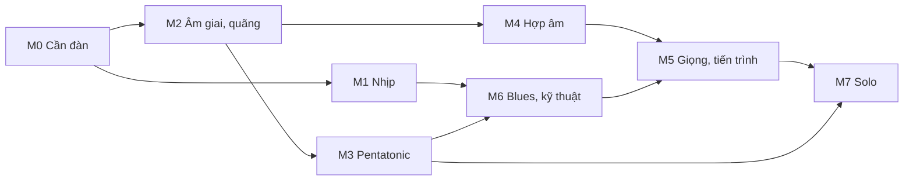

# Kho kiến thức Theory

Đây là nguồn kiến thức chuẩn cho app Theory. Các phiên làm bài đọc những file này thay vì đọc sách. Kho được dựng từ cuốn *Learn & Master Guitar* (Steve Krenz, bản dịch tiếng Việt của lazyguitar), nhưng **viết lại hoàn toàn bằng lời của dự án**: không trích câu, không chép bài tập, không chép bản nhạc. Thứ được giữ lại là kiến thức nhạc lý (công thức, quan hệ, thứ tự học), vốn là kiến thức chung.

Kho được sắp theo lộ trình học của Theory, không theo thứ tự chương của sách. Mỗi khái niệm có một mã (`K3.2`…) để bài học, test và PR tham chiếu.

## Cách dùng trong một phiên

1. Đọc file này để nắm mã khái niệm, thuật ngữ và các chỗ sách in sai.
2. Đọc file module mà phiên đó cần (bảng bên dưới). Không cần đọc các module khác.
3. Mỗi bài học ghi rõ nó dạy những mã nào. Nếu bài cần một khái niệm chưa có, thêm khái niệm vào đúng module trong cùng PR.
4. Nếu dạy khác với ghi chú ở đây (thứ tự, cách minh họa), sửa file kiến thức trong cùng PR để kho luôn khớp với app.

## Các module

| Module | File | Phiên dùng | Nội dung |
| --- | --- | --- | --- |
| M0 Cần đàn | [m0-fretboard.md](m0-fretboard.md) | 1.1 | Dây, phím, tab, nửa cung, hình quãng 8, tìm nốt nhà |
| M1 Nhịp | [m1-rhythm.md](m1-rhythm.md) | 1.2 | Phách, giá trị nốt, đếm, quạt dây, swing |
| M2 Âm giai và quãng | [m2-scales-intervals.md](m2-scales-intervals.md) | 1.3, 4.3 | Âm giai trưởng, đánh vần, quãng, hình quãng, âm giai thứ, giọng song song, 3 nốt mỗi dây |
| M3 Pentatonic | [m3-pentatonic.md](m3-pentatonic.md) | 0.3, 2.1 | Pentatonic trưởng/thứ, 5 hộp, đổi nhà, mẫu luyện ngón |
| M4 Hợp âm | [m4-chords.md](m4-chords.md) | 2.3, 3.1–3.3 | Hợp âm ba, power chord, hợp âm 7, mở rộng, dây buông, chặn di động, đảo |
| M5 Giọng và tiến trình | [m5-keys-progressions.md](m5-keys-progressions.md) | 2.2, 4.1 | Hợp âm thuận, số La Mã, blues 12 ô, V–I, II–V–I |
| M6 Blues và kỹ thuật guitar điện | [m6-blues-technique.md](m6-blues-technique.md) | 2.2, 2.3 | Âm giai blues, nốt blue, nhéo, luyến, trượt, chặn tiếng, double stop, quãng 8 |
| M7 Solo | [m7-soloing.md](m7-soloing.md) | 4.2 | Chọn âm giai, nốt đích theo hợp âm, xây câu, luyện tai |

## Thứ tự học

Mũi tên nghĩa là "cần học trước". Thứ tự này khớp với lộ trình trong [`docs/theory-plan.md`](../theory-plan.md): pentatonic và blues đến sớm, hợp âm và giọng đến sau.

## Bản đồ chương sách → khái niệm

Dùng khi muốn biết một chương của sách đã được đưa vào đâu.

| Chương | Đưa vào |
| --- | --- |
| 1 Bắt đầu | K0.1, K0.3, K0.8 |
| 2–4 Đọc nhạc, nốt dây 1–6 | K1.2 (giá trị nốt, lặng, chấm dôi, dấu nối), K0.5 (thăng giáng). Phần khuông nhạc: gác lại |
| 5–6 Hợp âm dây buông, sus, m7 | K4.1, K4.5 |
| 7 Hợp âm chặn dây 6, âm giai trưởng | K0.2, K0.5, K0.7, K2.1, K2.2, K4.6 |
| 8 Hợp âm chặn dây 5, hóa biểu, song song | K0.7, K2.2, K2.8, K4.6 |
| 9 Quạt dây, quãng | K1.4, K2.3, K2.4, K2.5 |
| 10 Fingerstyle | Gác lại |
| 11 Pentatonic | K3.1–K3.7 |
| 12 Hợp âm nâng cao | K4.4, K4.6, K4.8 |
| 13 Blues | K6.1, K6.2, K5.4, K4.1 |
| 14 Kỹ thuật | K6.3, K6.4, K6.5, K6.7 |
| 15 Guitar điện | K4.2, K6.6, K5.2 |
| 16 Quạt dây nâng cao | K1.2 (móc kép), K1.4 (trọng âm) |
| 17 Ngoài thế thứ nhất | K2.9, K4.3, K1.5 (liên ba) |
| 18 Jazz | K4.4, K5.5, K4.9. Giai điệu hợp âm: gác lại |
| 19 Solo | K7.1–K7.6 |
| 20 Hợp âm cần biết | K4.3, K4.4, K4.7, K4.8 |

## Những gì tạm gác lại

Các phần này có trong sách nhưng chưa vào Theory. Không xóa khỏi danh sách; khi nào cần thì mở thành module mới.

- Đọc khuông nhạc, khóa Sol, tên nốt trên dòng và khe (ch. 2–4).
- Đọc hóa biểu và mẹo đoán giọng qua hóa biểu (ch. 8). Theory dạy giọng qua nốt nhà và hợp âm thay vì ký hiệu.
- Lên dây bằng piano (ch. 1). Lên dây bằng tai thì giữ, vì nó là ví dụ của K0.4.
- Fingerstyle và guitar cổ điển (ch. 10).
- Giai điệu hợp âm kiểu jazz (ch. 18).
- Chicken pickin' và nhéo kiểu country (ch. 15).
- Các bài hát và track Jam Along của sách. Theory tự sinh vòng đệm và bài tập.

## Thuật ngữ Việt – Anh

Dùng thống nhất trong lời giảng cả hai thứ tiếng. Cột "Theory dùng" là từ ưu tiên khi có nhiều cách gọi.

| Theory dùng (vi) | Cách gọi khác (vi) | English |
| --- | --- | --- |
| dây buông | | open string |
| phím | ngăn | fret |
| nửa cung | | semitone, half step |
| một cung | nguyên cung | whole step |
| quãng | | interval |
| quãng 8 | | octave |
| âm giai | gam, scale | scale |
| bậc | | degree |
| nốt nhà | chủ âm, nốt gốc | root, tonic |
| hộp | kiểu, thế bấm, position | box, position |
| pentatonic | ngũ cung | pentatonic |
| hợp âm ba | | triad |
| hợp âm chặn | hợp âm barre | barre chord |
| hợp âm át | 7 át | dominant (7th) chord |
| giọng | tone, khóa | key |
| hóa biểu | | key signature |
| giọng song song | trưởng/thứ song song | relative key |
| giọng cùng tên | | parallel key |
| tiến trình | vòng hợp âm | chord progression |
| phách | nhịp | beat |
| ô nhịp | | bar, measure |
| số chỉ nhịp | | time signature |
| nhéo dây | bend | bend |
| luyến lên | | hammer-on |
| luyến xuống | | pull-off |
| trượt | | slide |
| chặn tiếng | palm mute | palm mute |
| nốt đích | | target note |
| nốt blue | | blue note |

Lưu ý: tiếng Việt gọi C trưởng và La thứ là "giọng song song" (cùng hóa biểu). Tiếng Anh gọi đó là *relative*; *parallel* trong tiếng Anh lại là hai giọng cùng chủ âm (C trưởng và C thứ). Khi dịch lời giảng, dùng *relative*.

Lời giảng tiếng Anh dùng thuật ngữ chuẩn, không dịch sát từng chữ tiếng Việt:

- "nốt nhà" là *root* (giọng: *tonic*), không phải "home note". "Home" chỉ dùng để giải nghĩa: "the root, the note that sounds like home".
- Bảng nốt trên dây 6 và 5 (K0.7) là "the notes on strings 6 and 5", không phải "home frets".
- Nốt 9, 11, 13 là *extension*, không phải "colour note". Hợp âm 7 của blues là *dominant 7th*, không viết trống "7 chords".
- Một phím là *semitone / half step*; *step* đứng một mình dễ bị hiểu là một cung.
- Chỗ lệch của cặp dây G–B gọi thống nhất là *the G–B shift*.

## Đính chính so với sách

Bản dịch có vài chỗ sai hoặc dễ gây hiểu lầm. Theory theo bản đúng dưới đây; test của lõi nhạc lý cũng dựa trên bản đúng.

| Chỗ trong sách | Sách ghi | Đúng là |
| --- | --- | --- |
| Ch. 9, thăng kép | gọi F## là "F giáng kép" | F## là F **thăng** kép |
| Ch. 11, giọng song song | quan hệ "giữa bậc V và bậc VI" | quan hệ giữa bậc **I** (trưởng) và bậc **VI** (thứ) |
| Ch. 13, âm giai blues | một âm giai 9 nốt 1 2 b3 3 4 b5 5 6 b7 | Theory tách làm hai: blues thứ 1 b3 4 b5 5 b7 và blues trưởng 1 2 b3 3 5 6 (K6.1) |
| Ch. 17, bảng hợp âm 7 | ký hiệu của 7 trưởng gồm cả "C7" | C7 là hợp âm **át**; 7 trưởng là Cmaj7 |
| Ch. 20, bảng hợp âm ba | dòng 1-b3-b5 ghi là "Tăng" | 1-b3-b5 là hợp âm **giảm** |
| Ch. 20, half-diminished | 1-b3-b3-b7 | 1-b3-**b5**-b7 |
