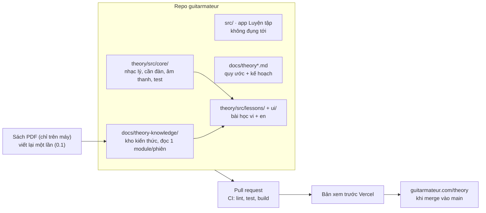
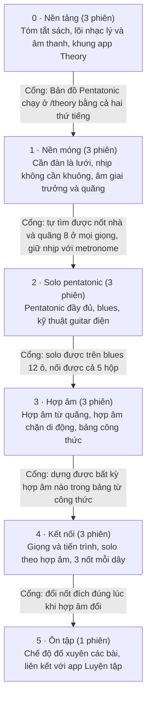

# Kế hoạch app Theory — chuyển Learn & Master Guitar sang học trực quan

Cập nhật: 2026-10-05 · File này là bản chuẩn của kế hoạch. Bảng tiến độ ở cuối file được cập nhật sau mỗi phiên.

## Mục tiêu và nguyên tắc

Dự án chia thành khoảng 16 phiên làm việc, gom vào 6 giai đoạn. Kết quả là **Theory**, một app riêng chạy ở `guitarmateur.com/theory`, làm song song tiếng Việt và tiếng Anh ngay từ đầu. Mỗi phiên thêm một bài học theo phong cách của Bản đồ Pentatonic, bản demo lưu ở [`docs/prototypes/ban-do-pentatonic.html`](prototypes/ban-do-pentatonic.html).

Cuốn Learn & Master Guitar dạy theo thứ tự cổ điển: đọc khuông nhạc trước, rồi tên nốt từng dây, rồi hợp âm, đến chương 11 mới tới pentatonic. Theory đảo lại thứ tự đó. Mục tiêu là người chơi guitar điện solo được sớm, còn lý thuyết chỉ xuất hiện khi cần cho việc đang tập.

Năm nguyên tắc áp dụng cho mọi bài:

1. **Hình trước, tên sau.** Mọi khái niệm hiện ra trên cần đàn dưới dạng khoảng cách (số phím). Tên nốt và ký hiệu chỉ là một lớp nhãn bật tắt được.
2. **Một bài, một ý.** Mỗi bước có một hình động, một câu kết luận và một thao tác để người học tự thử.
3. **Nghe được.** Bấm vào đâu cũng phát ra tiếng. Nhịp và tiết tấu được dạy bằng âm thanh và lưới thời gian, không dùng khuông nhạc.
4. **Tạm gác lại có chủ đích.** Mỗi trang ghi rõ những gì chưa cần học, để người học không phải tập trung vào mọi thứ cùng lúc.
5. **Viết lại bằng lời của mình.** Sách chỉ là bản đồ kiến thức. Bài học không chép lời văn, bài tập hay bản nhạc có bản quyền của sách.

## Sách gồm những gì

Sách có 20 chương, khoảng 110 trang, lộ trình dự kiến hơn 45 tuần. Khoảng một phần năm số trang (chương 2–4, khoảng 24 trang) dành cho đọc khuông nhạc và điền tên nốt, còn pentatonic phải đến chương 11 mới xuất hiện. Bảng dưới đây xếp mỗi chương vào một trong ba cách xử lý: giữ và vẽ lại, rút gọn thành công cụ, hoặc tạm gác lại.

| Chương | Nội dung trong sách | Cách xử lý | Vào module |
| --- | --- | --- | --- |
| 1 | Tên dây, cầm phím, đọc tab, hợp âm C, G7 | Giữ phần tab và tên dây | M0 Cần đàn |
| 2–4 | Khuông nhạc, nốt từng dây, giá trị nốt, dấu nối, chấm dôi, thăng giáng | Thay tên nốt bằng hình quãng 8. Thay khuông nhạc bằng lưới nhịp | M0, M1 Nhịp |
| 5–6 | Hợp âm dây buông, sus, m7 | Giữ, giải thích bằng công thức quãng | M4 Hợp âm |
| 7 | Nửa cung, một cung, hợp âm chặn dây 6, âm giai trưởng | Giữ. Đây là gốc của mọi lý thuyết | M2 Âm giai, M4 |
| 8 | Hợp âm chặn dây 5, giọng, hóa biểu, trưởng/thứ song song | Giữ phần song song. Gác phần đoán giọng qua hóa biểu | M4, M5 Giọng |
| 9 | Quạt dây, quãng nguyên cung | Quạt dây vào lưới nhịp. Quãng thành hình trên cần | M1, M2 |
| 10 | Fingerstyle, cổ điển | Tạm gác lại | — |
| 11 | Pentatonic, 5 kiểu, mẫu bộ 3 và bộ 4 | Giữ toàn bộ. Đã có bản demo | M3 Pentatonic |
| 12 | Hợp âm 2, maj7, m11 di động, hợp âm thay thế | Rút gọn thành bộ hình di động | M4 |
| 13 | Âm giai blues, b5, tiến trình 12 ô, hợp âm ba | Giữ. Ưu tiên cao cho guitar điện | M6 Blues, M4 |
| 14 | Trượt, nhéo dây, luyến âm | Giữ, minh họa bằng đường cong cao độ | M6 |
| 15 | Power chord, country, trượt quãng 4 | Giữ phần power chord và double stop | M6 |
| 16 | Quạt dây móc kép, trọng âm | Rút gọn vào lưới nhịp | M1 |
| 17 | Âm giai 3 nốt mỗi dây, hợp âm 7 | Giữ | M2, M4 |
| 18 | Jazz: maj7/m7 di động, II–V, giai điệu hợp âm | Giữ II–V. Gác phần giai điệu hợp âm | M5 |
| 19 | Solo theo giọng và nốt hợp âm | Giữ. Đây là đích đến của cả bộ | M7 Solo |
| 20 | Bảng công thức hợp âm, đảo, hợp âm trầm | Biến thành công cụ tra cứu tương tác | M4 |

Các track Jam Along trên CD không dùng lại được. Chúng sẽ được thay bằng vòng đệm tự sinh trong trình duyệt.

Kiến thức của sách đã được viết lại bằng lời của dự án và sắp theo lộ trình Theory trong [`docs/theory-knowledge/`](theory-knowledge/README.md): 8 module, 57 khái niệm có mã (`K3.2`…), kèm bản đồ chương → khái niệm, bảng thuật ngữ Việt–Anh và danh sách chỗ sách in sai. Đây là nguồn kiến thức cho mọi phiên; không phiên nào cần đọc lại sách.

## Guitarmateur và app Theory

Theory là một app riêng. Nó nằm trong cùng repo và cùng tên miền với Guitarmateur nhưng không dùng chung code. Hai app dành cho hai nhóm người khác nhau:

- **App Luyện tập** ở trang chủ: dành cho người đã hiểu nhạc lý, dùng để tra cứu và tập scale.
- **App Theory**: dành cho người đang học, gồm lý thuyết, bài tập và cách áp dụng trên guitar điện.

Việc nối hai app với nhau để sau. Khảo sát dựa trên commit `4dfdc73` ngày 15/9/2026.

| Phần | App Luyện tập đang có | App Theory làm gì |
| --- | --- | --- |
| Nhạc lý | `src/music/`: tên nốt đúng chính tả, quãng mang cả số bậc và số nửa cung | Viết lõi riêng nhỏ hơn, cùng nguyên tắc, có test. Không import từ app chính |
| Cần đàn | `src/fretboard/` tính hộp bằng thuật toán, `FretboardDiagram` vẽ tĩnh một vùng phím | Cần đàn đầy đủ, có hình động, bấm nốt để nghe |
| Âm thanh | `src/audio/`: sóng sawtooth qua mô phỏng amp, nghe chưa hay | Dựa trên tiếng gảy (Karplus-Strong) của Bản đồ Pentatonic rồi chỉnh thêm |
| Ngôn ngữ | Catalog en và vi, test bắt hai bản phải đủ khóa | Catalog riêng; vi và en viết trong cùng một PR |
| Công cụ | Vite, TypeScript strict, Vitest, ESLint, CI, Vercel | Dùng chung nguyên như vậy |

Sáu quyết định:

1. **App riêng trong cùng repo.** Thêm một entry Vite thứ hai là `theory/index.html`, code nằm trong `theory/src/`. ESLint chặn import qua lại giữa `src/` và `theory/src/`. Bản build ra `dist/theory/` và chạy ở `/theory`. Vì hiện `tsconfig.app.json` chỉ có `"include": ["src"]` và các luật ESLint chỉ nhắm vào `src/...`, phải thêm cấu hình cho `theory/` (ví dụ `tsconfig.theory.json` được tham chiếu từ `tsconfig.json`, glob ESLint cho `theory/**`, và kiểm tra Vitest chạy test trong `theory/`). Nếu không, CI sẽ bỏ qua typecheck và luật import của Theory.
2. **Hai ngôn ngữ cùng lúc, tiếng Anh là chính.** Tiếng Anh là ngôn ngữ chính và luôn là mặc định; slug và code dùng tiếng Anh. Mỗi bài có lời giảng `en` và `vi`, viết trong cùng một PR. Một test kiểm tra hai bản có cùng các bước và cùng khóa, để không bản nào bị thiếu.
3. **Âm thanh mới.** Lấy tiếng gảy trong `docs/prototypes/ban-do-pentatonic.html` làm điểm xuất phát, sau đó thêm chỉnh âm sắc, nhéo dây và trượt khi cần. Âm thanh chỉ phát sau khi người dùng thao tác.
4. **Lõi nhạc lý riêng, có test.** Theo cùng nguyên tắc với `src/music/`: làm việc với tên nốt đã đánh vần đúng (âm giai F thứ có B♭, không có A♯), không dùng số thứ tự nốt thuần túy.
5. **Đường dẫn `/theory/<bài>`.** Cần thêm rewrite trong `vercel.json`. Khi offline, service worker hiện tại (`public/sw.js`) trả về trang chủ cho mọi đường dẫn, nên phải sửa để `/theory` trả về trang của Theory.
6. **Sách không vào repo, kiến thức thì có.** File PDF chỉ nằm trên máy bạn. Kiến thức của sách được viết lại trong `docs/theory-knowledge/`: không trích câu, không chép bài tập hay bản nhạc, chỉ giữ công thức, quan hệ và thứ tự học.

Tiến độ học của người dùng được lưu trong localStorage của Theory, dùng khóa khác với app Luyện tập.

## Kiến trúc

Theory nằm trong thư mục `theory/` của repo và có entry Vite riêng. Mỗi bài học là một pull request. CI chạy lint, typecheck, test và build. Vercel tạo bản xem trước cho từng PR, và bài học lên `guitarmateur.com/theory` khi được merge vào main.



Phần việc của Theory gồm bốn phần:

- `theory/src/core/`: nhạc lý, cần đàn, âm thanh, lưới nhịp, tất cả đều có test;
- `theory/src/lessons/`: dữ liệu bài và kịch bản cảnh, mỗi bài kèm lời giảng `vi` và `en`;
- `theory/src/ui/`: cần đàn có hình động, khung trang bài, mục lục, chọn ngôn ngữ;
- `docs/theory-knowledge/` là kho kiến thức; `docs/theory.md` (viết ở phiên 0.2) ghi quy ước code và bài học; bản kế hoạch này nằm ở `docs/theory-plan.md`.

App Luyện tập trong `src/` không bị đụng tới, trừ các file dùng chung là `vercel.json`, `vite.config.ts`, `tsconfig.json`, service worker và cấu hình ESLint. Bản demo Bản đồ Pentatonic nằm ở `docs/prototypes/` để tham khảo, không được ship và không được import. File PDF của sách không nằm trong repo.

## Lộ trình theo giai đoạn

Pentatonic và blues nằm ở giai đoạn 2, ngay sau phần nền móng tối thiểu. Trong sách, phần này nằm ở chương 11 và 13. Hợp âm và giọng để sau vì đến lúc đó người học đã có lý do để cần chúng.



Mỗi cổng là một việc người học phải tự làm được trên đàn. Chưa qua cổng thì nên sửa bài cũ trước khi làm bài mới. Chi tiết từng phiên nằm trong bảng tiến độ ở cuối tài liệu.

## Cách làm mỗi phiên

Mỗi phiên là một cuộc trò chuyện mới, làm đúng một bài học và kết thúc bằng một PR. Bắt đầu cuộc trò chuyện mới giúp Claude không phải mang theo toàn bộ lịch sử các phiên trước, nhờ vậy tốn ít token hơn.

Quy trình trong một phiên:

1. **Nạp bối cảnh.** Claude đọc `AGENTS.md`, `docs/theory.md`, `docs/theory-knowledge/README.md` và file module của bài. Không đọc sách.
2. **Chọn ý.** Claude gửi một dàn ý ngắn gồm 3–5 bước. Mỗi bước có một câu kết luận và mô tả hình động. Dàn ý kèm danh sách những gì "tạm gác lại".
3. **Bạn duyệt dàn ý.** Sửa ở bước này chỉ tốn vài trao đổi. Sửa sau khi đã code xong tốn gấp nhiều lần.
4. **Dựng bài trên một nhánh mới.** Claude viết dữ liệu bài, lời giảng tiếng Việt và tiếng Anh, dùng lõi có sẵn trong `theory/src/core/`. Nếu cần thành phần mới dùng lại được, thành phần đó được thêm vào lõi kèm test.
5. **Kiểm tra như CI.** Chạy lint, typecheck, test, build theo đúng thứ tự. Sau đó xem trang một lần trên dev server, ở cả hai ngôn ngữ.
6. **Tự review, merge và ghi sổ.** Claude tự review thay đổi của mình, mở PR vào `main`, chờ CI xanh rồi tự merge. Merge vào `main` là Vercel đưa lên `guitarmateur.com` ngay, không có ai duyệt thêm. Đây là trang cá nhân nên chấp nhận rủi ro hỏng; nếu hỏng thì sửa bằng một PR mới hoặc rollback trên Vercel. Chi tiết ở checklist dưới đây.

### Checklist kết thúc phiên

Làm đủ từng bước, theo thứ tự. Bước nào không làm được thì dừng lại và báo, không merge.

1. **Ghi sổ trong chính nhánh của phiên**, trước khi mở PR:
   - đổi trạng thái của phiên trong bảng tiến độ thành "Xong";
   - cập nhật mục "Việc còn treo": thêm việc phát hiện mà chưa làm, xóa việc đã làm xong;
   - nếu bài dạy khác kho kiến thức, sửa file kiến thức (quy ước trong `docs/theory.md`).
2. **Tự review.** Chạy `/code-review` trên nhánh của phiên. Sửa mọi lỗi về đúng sai, đặc biệt là kiến thức nhạc lý (tên nốt, bậc, công thức) và độ khớp giữa bản vi và en. Ghi những điểm cố ý không sửa vào PR.
3. **Kiểm tra như CI:** `npm run lint`, `npm run typecheck`, `npm test`, `npm run build`, theo đúng thứ tự.
4. **Mở PR vào `main`:** `gh pr create --base main`. Không chồng PR lên nhánh khác: CI sẽ fail nếu base không phải `main`. Phiên 0.2 từng mất code vì PR chồng được merge vào một nhánh đã merge rồi.
5. **Chờ CI rồi merge:** `gh pr checks <số> --watch`, xanh thì chạy `gh pr merge <số> --squash --delete-branch`. Nếu `main` vừa có commit mới làm PR không merge được, chạy `gh pr update-branch <số>` rồi chờ CI lại.
6. **Xác nhận đã lên web:**
   - `git log origin/main` có commit của phiên;
   - Vercel đã tạo bản Production cho commit đó: `gh api repos/{owner}/{repo}/deployments --jq '.[0]'`;
   - trang của bài mở được trên `guitarmateur.com`.
7. **Báo lại:** gửi link PR, link trang trên production và những điểm đã ghi vào "Việc còn treo".

### Việc còn treo

Những điều các phiên trước phát hiện nhưng chưa làm. Phiên sau đọc mục này thay vì đọc lại PR cũ. Ghi mỗi việc một dòng, kèm phiên phát hiện.

- (0.2) Luật ESLint của app Luyện tập dạng `'**/fretboard/**'` bỏ sót import trỏ thẳng vào thư mục như `'../fretboard'` từ `src/music`. Luật của Theory đã dùng `dir()` để bắt cả hai dạng. Sửa bằng một PR riêng cho `src/`.
- (0.2, 0.3) Test của Theory chạy chung setup `src/test/setup.ts` của app Luyện tập. File này chỉ bật cờ `act` của React nên test UI của Theory (0.3) dùng được. Chỉ tách khi Theory cần setup khác.
- (0.3) Offline: service worker cache shell `/theory` khi cài, còn JS/CSS chỉ được cache ở lần tải đầu có service worker. Người chỉ mở Theory đúng một lần rồi mất mạng sẽ thấy trang trắng. App Luyện tập cũng vậy. Nếu cần, cache trước tài nguyên lúc build.
- (0.3) `App.test.tsx` in log `Not implemented: navigation to another Document` của jsdom khi chạy cả file (chạy từng test thì không). Test vẫn pass; chưa tìm ra test nào gây ra.
- (1.2) K1.5 (liên ba, swing, shuffle) chưa có bài; phiên 2.2 dạy nó. `core/rhythm` mới chia phách thành 1, 2 hoặc 4 ô: cần thêm chia 3 và hệ số swing, kèm test.
- (1.2) Tab chưa nằm trên lưới phách: bài luyện ngón chạy tab và `BeatGrid` riêng. Ghép hai thứ khi một bài cần tab có tiết tấu (2.2 hoặc 4.2).
- (1.2) Tempo của mỗi cảnh không được nhớ giữa các lần mở trang. Nếu người học cần, lưu vào localStorage của Theory với khóa riêng.
- (1.1) Bài đố nốt nhà không lưu kết quả. Chế độ ôn tập chung thuộc phiên 5.1.
- (1.1) `App.test.tsx` còn in thêm `Not implemented: Window's scrollTo()` của jsdom (từ `App.tsx` khi chuyển trang). Vô hại, cùng loại với log navigation ở trên.
- (1.3) `FINDER_KEYS` của Bản đồ Pentatonic gõ tay tên giọng thứ (G♯, C♯, E♭…). Lõi mới có `majorKeyTonic()` cho giọng trưởng; khi phiên 2.1 hoặc 4.1 cần tên giọng thứ, thêm quy tắc vào lõi (qua `relativeMinorTonic`) rồi sinh danh sách từ đó.
- (1.3) `octaveUp()` và `shapeAt(p, '8', 2)` cùng một phép tính; `octaveUp` không chặn `MAX_FRET`. Gộp khi sửa lõi lần sau.
- (1.3) Bước quãng của `/theory/major-scale` cố định nốt nhà C trên dây 5. Nếu người học cần, cho đổi nốt nhà.
- (0.3) Bài Bản đồ Pentatonic đã lên `/theory/pentatonic-map`. Phiên 2.1 (pentatonic đầy đủ) dùng slug riêng, ví dụ `/theory/pentatonic`, và dùng lại `Fretboard`, `scenes.ts`.

Prompt mẫu để mở một phiên. Bạn chỉ cần thay mã phiên và chương:

```
Dự án Theory trong Guitarmateur, phiên 2.2 (Blues).
Kế hoạch: docs/theory-plan.md. Repo: nguyentamgm/guitarmateur (cần quyền push).
Đọc AGENTS.md, docs/theory.md, docs/theory-plan.md, docs/theory-knowledge/README.md,
m6-blues-technique.md và m5-keys-progressions.md. Không đọc sách.
Chỉ làm trong theory/; không import từ src/.
Dùng lõi trong theory/src/core/; chỉ thêm vào lõi khi thiếu, kèm test.
Gửi dàn ý trước, chờ tôi duyệt rồi mới code.
Đầu ra: bài /theory/blues bằng tiếng Việt và tiếng Anh. Kết thúc theo
"Checklist kết thúc phiên" trong docs/theory-plan.md: ghi sổ, tự review, chạy CI,
PR vào main, tự merge khi CI xanh, xác nhận đã lên guitarmateur.com.
```

## Tiết kiệm token và rủi ro

Phần lớn token bị tốn vào ba việc: đọc lại nguồn, viết lại code đã có, và sửa một trang đã dựng xong. Kế hoạch này chặn cả ba.

- **Viết lại sách một lần.** Phiên 0.1 đã chuyển kiến thức của sách thành `docs/theory-knowledge/`, chia theo module, mỗi file vài nghìn token. Mỗi phiên chỉ đọc README của kho và một hai module mình cần.
- **Lõi làm một lần.** Phiên 0.2 dựng nhạc lý, cần đàn và âm thanh cho Theory. Từ đó trở đi, một bài mới chủ yếu là dữ liệu và lời giảng.
- **Duyệt dàn ý trước khi code.** Đây là cách rẻ nhất để đổi hướng.
- **Mỗi phiên một cuộc trò chuyện mới.** `docs/theory.md`, `docs/theory-plan.md` và kho kiến thức thay cho lịch sử trò chuyện. Claude chỉ đọc phần code mình sắp sửa, không đọc cả repo.
- **Không dùng agent phụ cho việc dựng bài.** Agent phụ bắt đầu từ con số 0 và phải nạp lại bối cảnh. Chỉ đáng dùng khi cần một người kiểm tra độc lập kiến thức nhạc lý của một bài quan trọng.

Ước lượng thô: mỗi phiên bài học tốn khoảng 120–250 nghìn token, vì mỗi bài phải viết hai thứ tiếng và chạy CI. Cả dự án khoảng 2,5–3,5 triệu token. Phiên 0.2 và 0.3 tốn nhất vì phải dựng lõi và khung app. Sau phiên 1.1, hãy xem số thực tế rồi chỉnh lại ước lượng này.

| Rủi ro | Cách xử lý |
| --- | --- |
| Sai kiến thức nhạc lý (tên nốt, bậc, công thức) | Mọi nốt đều do lõi Theory tính ra, không gõ tay. Lõi có test chính tả cho cả 12 giọng. Mỗi bài thêm test cho các cảnh của mình |
| Bản tiếng Việt và tiếng Anh lệch nhau | Test so hai bản phải có cùng bước và cùng khóa. Thuật ngữ được thống nhất theo bảng trong `docs/theory-knowledge/README.md` |
| Theory vô tình phụ thuộc app Luyện tập, hoặc code Theory không được CI kiểm tra | ESLint chặn import qua lại giữa `src/` và `theory/src/`. Phiên 0.2 đã đưa `theory/` vào typecheck, lint và test, và thử import sai để chắc luật có tác dụng |
| Tải lại `/theory/<bài>` bị lỗi 404, hoặc offline thì mở ra trang chủ | Ngay ở phiên 0.3: thêm rewrite trong `vercel.json`, sửa service worker, kiểm tra trên bản xem trước |
| Sửa file dùng chung làm hỏng app Luyện tập | Chỉ có `vercel.json`, `vite.config.ts`, `tsconfig.json`, service worker và cấu hình ESLint là dùng chung. Kiểm tra trang chủ trên bản xem trước mỗi khi một trong các file này thay đổi |
| Bản quyền của sách | PDF không vào repo. Kho kiến thức chỉ giữ công thức, quan hệ và thứ tự học, viết bằng lời của dự án; không trích câu, không chép bài tập, biểu đồ hay bản nhạc. Bài tập được tự sinh |
| Kho kiến thức và app lệch nhau | Mỗi bài ghi các mã khái niệm nó dạy. Đổi cách dạy thì sửa file kiến thức trong cùng PR |
| Đường cong nhéo dây và tiết tấu khó minh họa | Làm thử một demo nhỏ ở đầu phiên đó trước khi dựng cả bài |

## Theo dõi tiến độ

Mỗi dòng là một phiên. Làm theo thứ tự từ trên xuống, nhưng sau giai đoạn 0 có thể đổi thứ tự các phiên trong cùng một giai đoạn. Trạng thái: Chưa làm · Đang làm · Xong.

| Phiên | Bài học / đầu ra | Nguồn trong sách | Trạng thái |
| --- | --- | --- | --- |
| 0.1 | Kho kiến thức `docs/theory-knowledge/`: 8 module, 57 khái niệm, bản đồ chương, thuật ngữ vi–en, đính chính | Cả sách | Xong |
| 0.2 | Lõi Theory: nhạc lý đánh vần đúng, cần đàn, tiếng gảy mới (từ bản demo trong `docs/prototypes/`), tất cả có test. Đưa `theory/` vào tsconfig, ESLint, Vitest (chuyển từ 0.3). Viết `docs/theory.md` | Ch. 7, 11 | Xong |
| 0.3 | Khung app Theory: entry Vite riêng, `/theory`, mục lục, chọn ngôn ngữ (en mặc định), rewrite Vercel, service worker. Bài thử: Bản đồ Pentatonic `/theory/pentatonic-map` (en + vi) | Ch. 11 | Xong |
| 1.1 | Cần đàn là lưới: đọc tab, hình quãng 8, tìm nốt nhà. Bài `/theory/fretboard` (en + vi), đứng đầu mục lục | Ch. 1–4, 7 | Xong |
| 1.2 | Nhịp không cần khuông: lưới phách, metronome, mẫu quạt; bài luyện ngón 1-2-3-4 và tư thế tay (K0.8, chuyển từ 1.1). Bài `/theory/rhythm` (en + vi), lõi `core/rhythm` | Ch. 1–3, 9, 16 | Xong |
| 1.3 | Âm giai trưởng và quãng là hình trên cần: công thức, đánh vần, tên quãng, hình quãng, bậc trong một thế. Bài `/theory/major-scale` (en + vi), đứng trước Bản đồ Pentatonic; bài đố nốt nhà thêm ♯/♭ | Ch. 7, 9 | Xong |
| 2.1 | Pentatonic bản đầy đủ: 5 hộp, mẫu bộ 3/bộ 4, nối hộp, trưởng/thứ song song | Ch. 11 | Chưa làm |
| 2.2 | Blues: nốt b5, tiến trình 12 ô, nhéo dây, trượt; liên ba và shuffle (K1.5, chuyển từ 1.2) | Ch. 13, 14, 17 | Chưa làm |
| 2.3 | Guitar điện: power chord, double stop, quãng 8 | Ch. 14, 15 | Chưa làm |
| 3.1 | Hợp âm là xếp chồng quãng: hợp âm ba, hợp âm dây buông | Ch. 5, 6, 13 | Chưa làm |
| 3.2 | Hợp âm chặn di động gốc dây 6 và dây 5, sus, m7, maj7, m11 | Ch. 7, 8, 12 | Chưa làm |
| 3.3 | Bảng công thức hợp âm tương tác, hợp âm 7, thế đảo | Ch. 17, 20 | Chưa làm |
| 4.1 | Giọng và tiến trình: số La Mã, trưởng/thứ song song, II–V–I | Ch. 8, 13, 18 | Chưa làm |
| 4.2 | Solo theo hợp âm: nốt đích sáng lên khi hợp âm đổi, vòng đệm tự sinh | Ch. 19 | Chưa làm |
| 4.3 | Âm giai 3 nốt mỗi dây, phủ toàn cần đàn | Ch. 17 | Chưa làm |
| 5.1 | Chế độ đố và ôn tập xuyên các bài, liên kết với app Luyện tập | Tất cả | Chưa làm |
